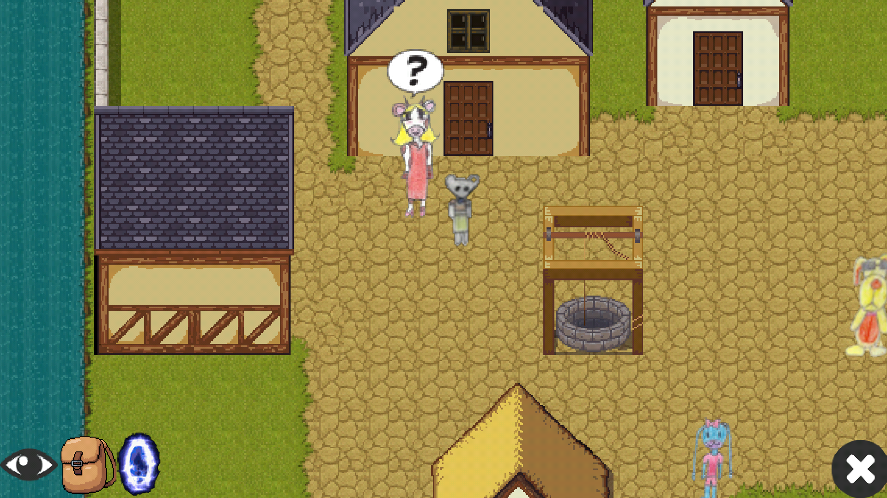
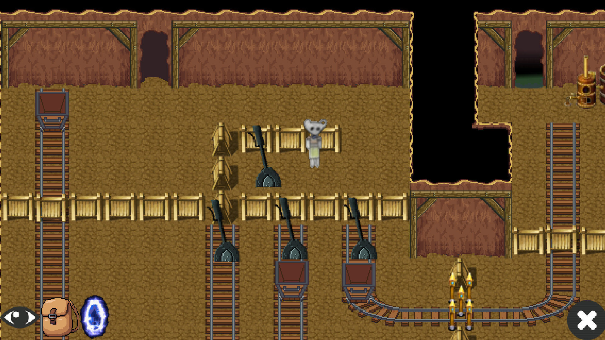

# SoukiAdventure
SoukiAdventure is an old school RPG game in orthogonal view.

Many time has been spent on rendering map level, collisions management and generic mechanisms to add easily new interactions in game. In spite of this time ellapsed on this game, it stays a self-educated work and lots of improvements could be brought.

It uses libgdx SDK but it was written more specificly for android (UI, controls, etc).
Tiled is used for level design but JSON files are massively used to describe level interactions.

To be continued...

#screenshots

